# 西藏景点分级库

这个文档先回答一个问题：**西藏有哪些顶级景点，哪些适合这次旅行观光团，哪些虽然有名但不适合硬塞。**

> 图片说明：不用 Wikimedia/Wiki 源，也不使用视频/攻略页链接。图片列只接受本地 `.jpg/.png` 文件或确认可长期访问的图片直链；暂时拿不到稳定图片的，标为 `待补本地 jpg`。

分级口径：

- **A 档**：本次路线里值得优先保留，能决定路线气质的核心景观。
- **B 档**：很值得，但更适合作为主线附近的增强项。
- **C 档**：顺路补充、拍照机位、休整点，时间紧可以删除。
- **排除/未来线**：很强，但距离、海拔、车程或体力成本不适合本次 13 天旅行观光团。

类型说明：

- **风景**：自然景观为主。
- **人文**：寺庙、古城、宗教/历史建筑和生活街区为主。
- **混合**：自然和人文都很强。

## 拉萨组

这一组是拉萨城市内或近郊人文核心。它们彼此距离近，应该作为一个整体考虑，而不是拆成多个孤立景点。

| 景点组 | 图片参考 | 档位 | 类型 | 具体位置 | 核心景象 | 对本次行程的意义 |
| --- | --- | --- | --- | --- | --- | --- |
| 布达拉宫外景 + 药王山观景台 + 宗角禄康公园 | 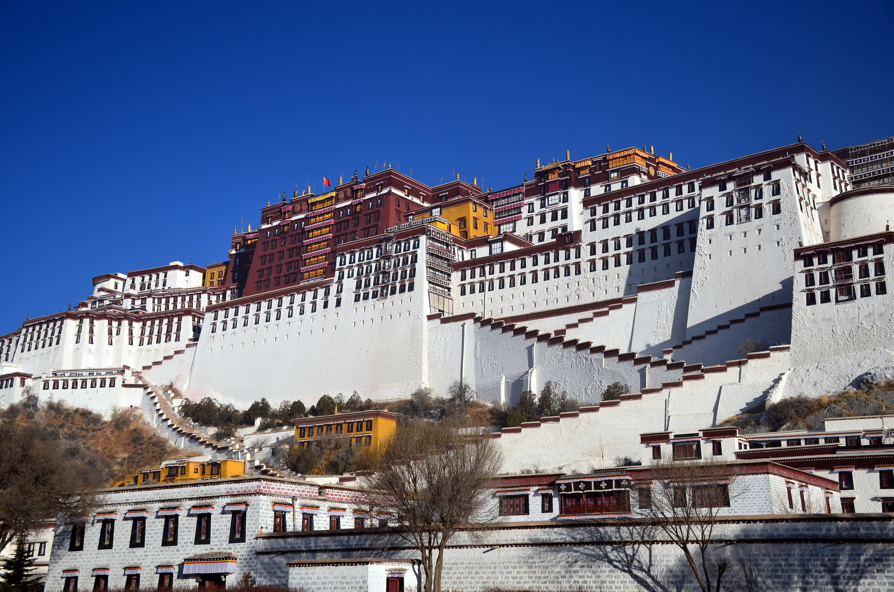 | A | 人文/混合 | 拉萨市城关区，北京中路、布达拉宫周边 | 西藏最强地标、经典机位、湖面倒影、城市背景 | 到拉萨必保留；10/5 晚到、10/6 飞成都的节奏下，优先拍外景和机位，不强求深度入内 |
| 大昭寺 + 八廓街 | 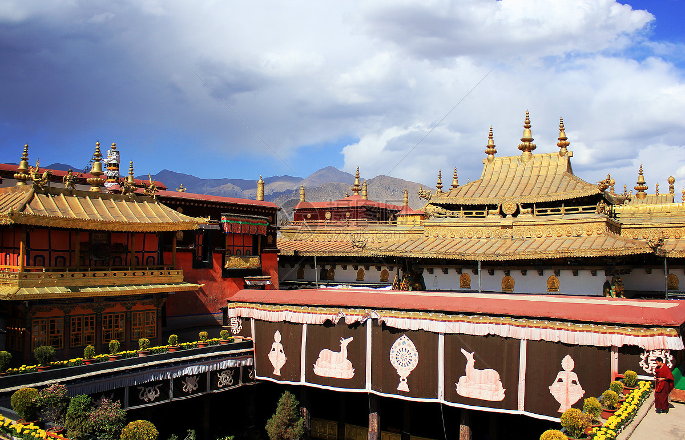 | A | 人文 | 拉萨市城关区八廓街核心区 | 朝圣、转经、藏式街巷、寺庙门面、人文氛围 | 拉萨人文照片最强点；适合半天轻量安排，走路强度可控 |
| 色拉寺 / 哲蚌寺二选一 | 待补 jpg：色拉寺/哲蚌寺 | B | 人文 | 拉萨市城关区、堆龙德庆区方向 | 寺庙建筑、僧人辩经、拉萨宗教日常 | 只有拉萨有完整一天时再选；本次如果 10/6 上午飞成都，大概率删掉 |

## 林芝组

这一组是“自然景观优先”路线最重要的区域。它和香格里拉重复感较低，特点是森林、峡谷、雪山、河谷和湖泊。

| 景点组 | 图片参考 | 档位 | 类型 | 具体位置 | 核心景象 | 对本次行程的意义 |
| --- | --- | --- | --- | --- | --- | --- |
| 雅鲁藏布大峡谷 + 南迦巴瓦峰机位 | 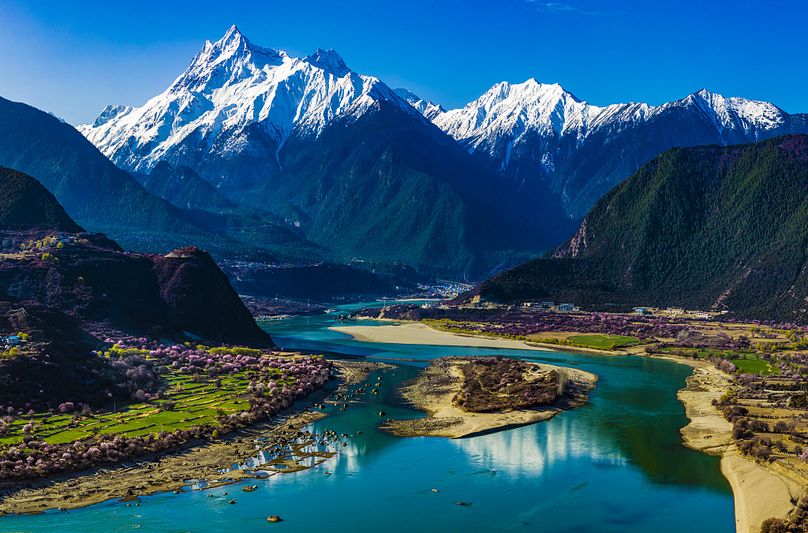 | A | 风景 | 林芝市米林市派镇、索松村一带 | 世界级峡谷、南迦巴瓦雪峰、雅江河谷、村落 | 顶级自然组；但需要从林芝分出时间，方案三可优先考虑，方案一时间紧则可能删 |
| 鲁朗林海 + 鲁朗牧场 | 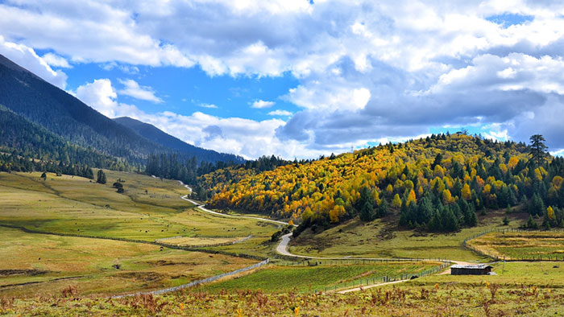 | A | 风景/混合 | 林芝市巴宜区鲁朗镇，G318 沿线 | 森林、牧场、藏式木屋、雪山视野 | 很适合本次，走路少、景观柔和，也适合拍人像 |
| 巴松措 | 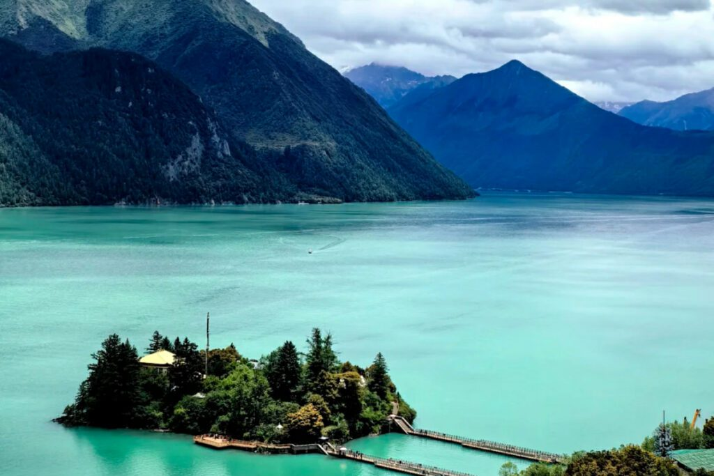 | B | 混合 | 林芝市工布江达县错高乡 | 湖泊、森林、湖心岛、藏寺 | 省力、成熟、适合从林芝去拉萨途中安排 |
| 尼洋河风光带 | 待补 jpg：尼洋河风光带 | C | 风景 | 林芝市巴宜区、工布江达县一带 | 河谷、湿地、森林、公路风景 | 顺路车览即可，不必专门安排大段时间 |

## 然乌 / 波密 / 冰川组

这一组是 318 自然景观线的核心。相比稻城亚丁，它更适合“少徒步、多车览”的旅行观光团。

| 景点组 | 图片参考 | 档位 | 类型 | 具体位置 | 核心景象 | 对本次行程的意义 |
| --- | --- | --- | --- | --- | --- | --- |
| 然乌湖 | 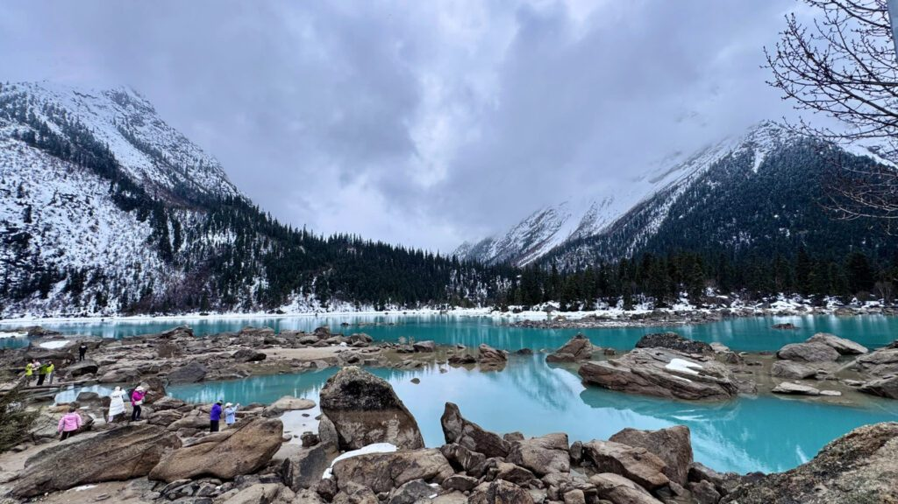 | A | 风景 | 昌都市八宿县然乌镇，G318 沿线 | 湖泊、雪山、公路、晨昏光影 | 318 自然线核心，适合放慢，不建议只匆匆路过 |
| 来古冰川 / 米堆冰川二选一 | 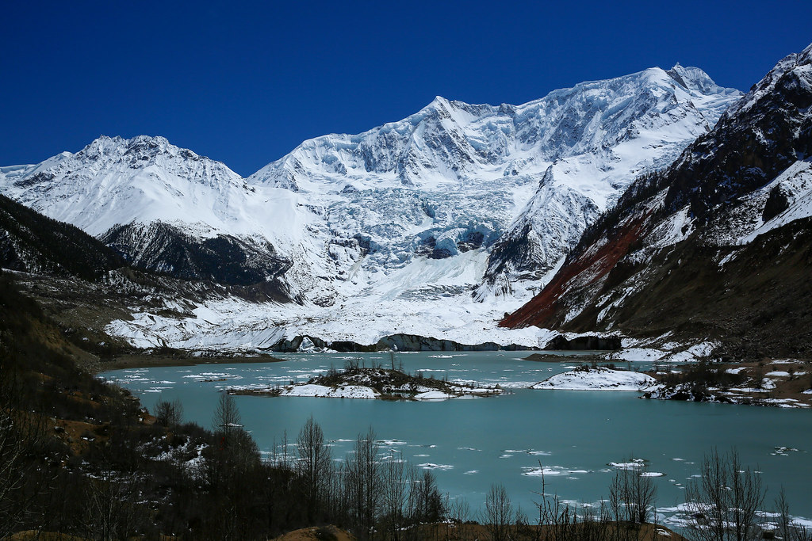 | A | 风景 | 来古在昌都市八宿县然乌镇方向；米堆在林芝市波密县玉普乡附近 | 冰川、冰湖、森林、村落、高差景观 | 二选一即可；不要同一天贪多，优先选路况和天气更稳的 |
| 波密古乡湖 / 岗云杉林 | 待补 jpg：古乡湖/岗云杉林 | B | 风景 | 林芝市波密县古乡、岗乡一带 | 森林、湖泊、雪山、河谷 | 方案三的休整增强项，适合少走路拍自然 |
| 怒江 72 拐 | 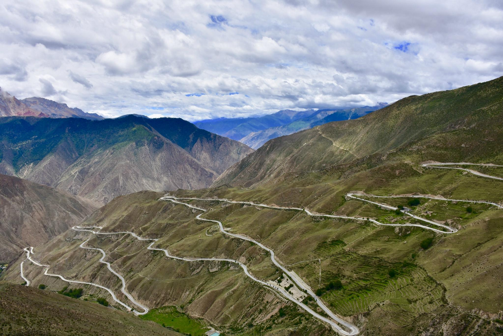 | C | 风景 | 昌都市八宿县业拉山至怒江峡谷一带 | 盘山公路、峡谷、垭口 | 318 顺路打卡，不建议停太久 |

## 拉萨周边可选组

这一组不是 318 主线必需，但如果拉萨能多留一天，可以作为自然风景增强项。

| 景点组 | 图片参考 | 档位 | 类型 | 具体位置 | 核心景象 | 对本次行程的意义 |
| --- | --- | --- | --- | --- | --- | --- |
| 羊卓雍措 | 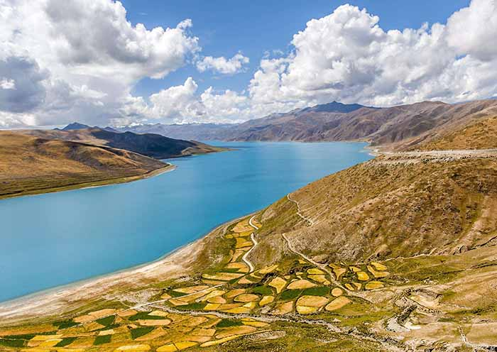 | A | 风景 | 山南市浪卡子县，拉萨往江孜方向 | 蓝绿色圣湖、曲折湖岸、岗巴拉山口俯瞰 | 比纳木错更容易从拉萨半日/一日往返；但本次 10/6 飞成都会比较难塞 |
| 纳木错 | 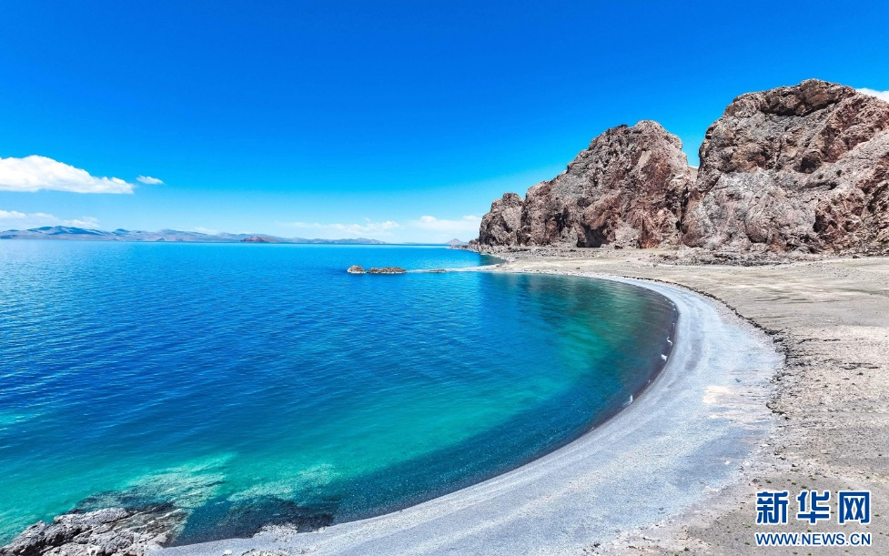 | A | 风景 | 拉萨市当雄县与那曲市班戈县之间 | 高原大湖、念青唐古拉山、辽阔湖岸 | 很强，但海拔高、车程长；本次不建议硬塞 |
| 卡若拉冰川 | 待补 jpg：卡若拉冰川 | C | 风景 | 山南浪卡子县与日喀则江孜县之间 | 公路边冰川、雪山 | 羊湖-江孜-日喀则线上顺路；本次不做日喀则线则删除 |
| 桑耶寺 / 雍布拉康 | 待补 jpg：桑耶寺/雍布拉康 | B | 人文 | 山南市扎囊县、乃东区泽当方向 | 西藏早期佛教和王朝遗迹，寺庙与山谷组合 | 人文价值高，但与 318 主线不顺；适合未来山南线 |

## 理塘 / 格聂可选组

格聂不在滇藏线上，而是在四川甘孜州理塘、巴塘之间。格聂南线可作为
G318 理塘至巴塘段的高海拔景观替代线，但不应把它理解为普通铺装公路上的
顺路景点。

| 景点组 | 图片参考 | 档位 | 类型 | 具体位置 | 核心景象 | 对本次行程的意义 |
| --- | --- | --- | --- | --- | --- | --- |
| 格聂神山 + 格聂之眼 | 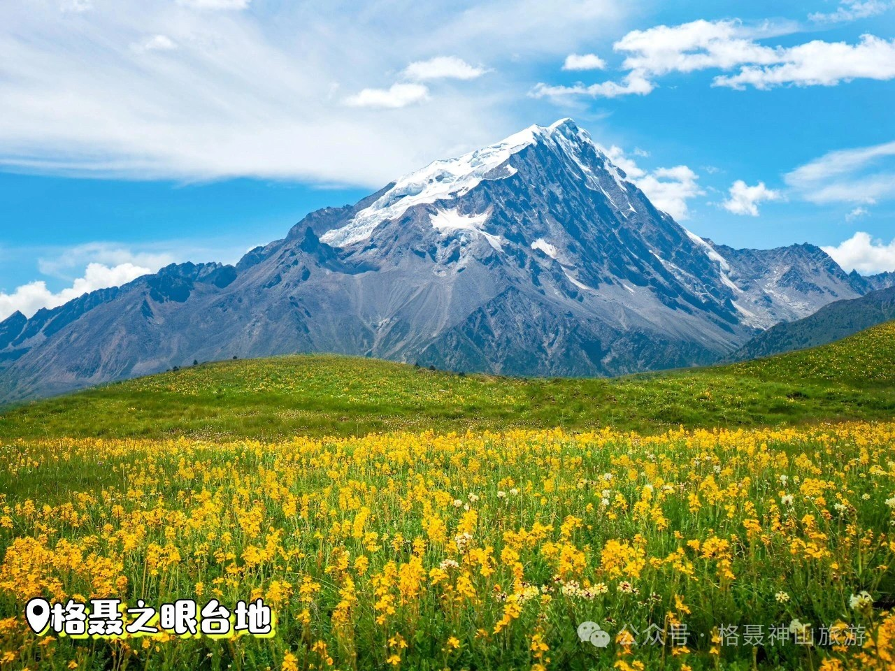 | A | 风景/混合 | 甘孜州理塘县格聂镇，格聂南线中段 | 格聂群峰、花海草原、格聂之眼、高原村落、冷古寺 | 可从理塘进入并在巴塘接回 G318；核心机位可短步行观景，但全线海拔高、路况和补给条件波动，只在司机熟悉线路并确认车型后选择 |

## 本次明确排除

这些地方名气很大，但本次定位是旅行观光团，不是高海拔长线拉练。先明确排除，避免后面路线越聊越膨胀。

| 区域 | 类型 | 为什么不适合本次 |
| --- | --- | --- |
| 珠峰 / 绒布寺 / 珠峰大本营方向 | 风景 | 需要额外拉萨-日喀则-定日长线，海拔高、车程长，还涉及边防证；这趟不去 |
| 日喀则深线：扎什伦布寺、萨迦寺等 | 人文 | 如果不去珠峰，专门绕日喀则的性价比下降；这趟先删 |
| 阿里线：冈仁波齐、玛旁雍措、古格王朝遗址 | 混合 | 顶级但太远，适合未来单独阿里线，不适合 13 天川藏观光团 |

## 对三套路线的启发

### 如果最终选方案一：综合 318 到拉萨

- 必保留：拉萨组、然乌湖、鲁朗、巴松措。
- 视体力保留：稻城亚丁轻量版、来古/米堆冰川二选一。
- 不建议强塞：纳木错、羊湖、珠峰、阿里。

### 如果最终选方案二：川西人文线

- 西藏自治区内 A 档会少很多，因为路线不进拉萨。
- 这条线要靠川西/317 的塔公、理塘、甘孜、德格、色达/观音桥做人文核心。
- 如果大家最后很想看布达拉宫和八廓街，这条就不是最优解。

### 如果最终选方案三：318 自然景观线

- 必保留：然乌/波密/冰川组、林芝组、拉萨组外景。
- 重点是把时间给藏东南：湖泊、冰川、森林、峡谷。
- 稻城亚丁可以删除或仅保留极轻量路过，避免和香格里拉体验重复。
- 珠峰、日喀则、阿里明确排除，别把旅行观光团做成高海拔耐力赛。

## 图片和资料来源

- 图片列只接受本地 `.jpg/.png` 文件或确认可长期访问的图片直链；不使用 Wikimedia/Wiki 源，也不使用视频页或攻略页作为图片。
- 景点评级参考了西藏 5A 景区名单和主流线路资源；[文化和旅游部资料](https://www.mct.gov.cn/whzx/qgwhxxlb/xz/202011/t20201110_901043.htm)提到雅鲁藏布大峡谷与布达拉宫、珠穆朗玛峰同列西藏顶级旅游资源，并列出布达拉宫、大昭寺、扎什伦布寺、巴松措、雅鲁藏布大峡谷等 5A 景区。
- 位置和线路判断参考：西藏自治区/文旅公开信息、景区介绍、318/林芝/山南/日喀则常规旅游线路资料。
- 格聂位置、景点与图片参考：[理塘县人民政府《格聂南线（一）》](https://www.gzlt.gov.cn/ltfg/article/590297)；景区范围参考[格聂神山规划环境影响评价公示](https://www.gzlt.gov.cn/ltxrmzf/c100333/201911/4f6345b4a37d414092d9882a8665526b.shtml)。
