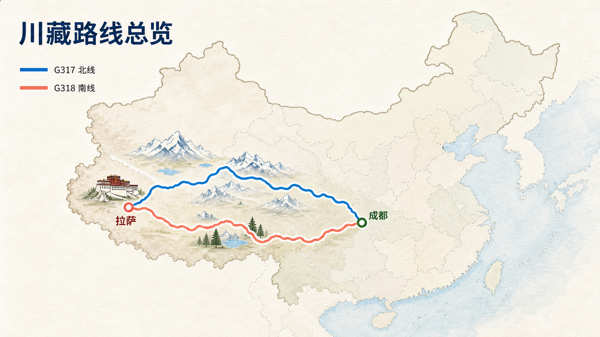
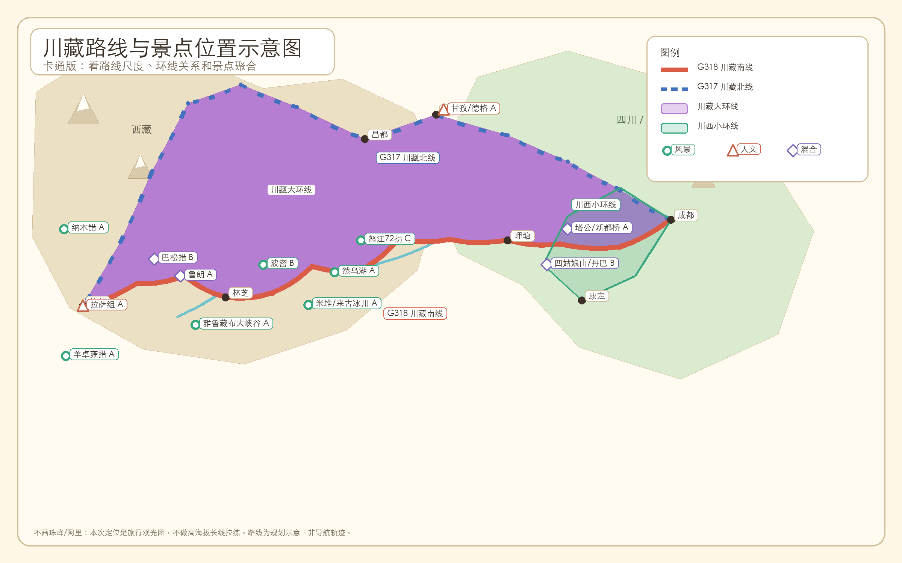
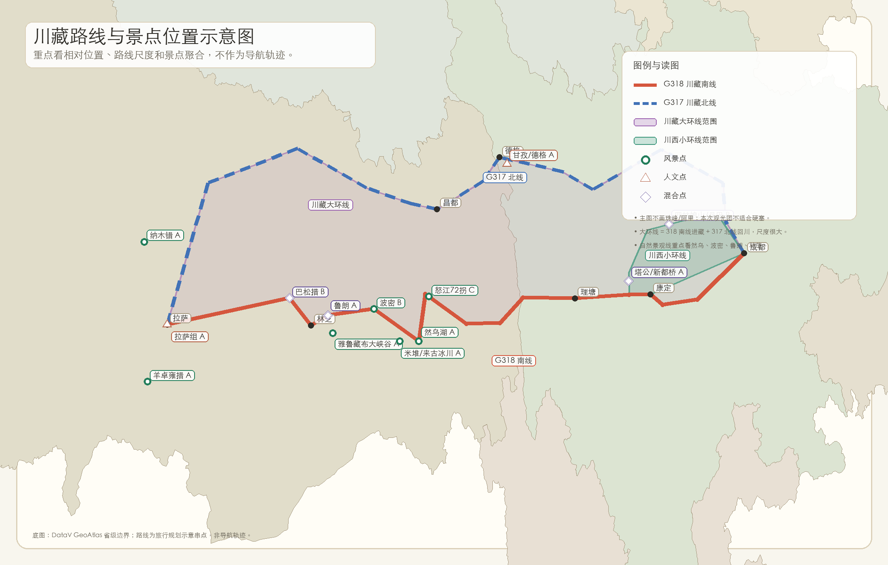

# 西藏/川西旅行路线草案

## 基本假设

- 人数：先按 4 人计算，最多可能增加到 5 人。
- 时间：2026-09-25 到 2026-10-07。
- 出发/返程：杭州往返成都更友好。
- 车辆：倾向包车 + 司机，车型希望为理想 L9 / 智己 LS9 这类全尺寸 SUV 或同级舒适车型。
- 旅行偏好：
  - 自然风光优先。
  - 兼顾人文风光，方便给同行女生拍照。
  - 不接受长途步行，不把徒步强度作为核心体验。
  - 高原反应风险优先级较高，路线应避免硬赶。
- 当前机票预期：
  - 杭州 <-> 成都：往返约 2500+ 元/人。
  - 拉萨 -> 成都：约 1700 元/人。
- 当前返程建议：
  - 如果去拉萨，建议 2026-10-06 离开拉萨飞成都。
  - 2026-10-07 从成都返回杭州，避免在国庆返程日从拉萨赶长中转，减少精力消耗。

## 三种路线候选

景点取舍先参考：[西藏景点分级库](./ATTRACTIONS.md)。

### 路线地图

首选查看 Node 交互版：[route-map-cartoon.html](./route-map-cartoon.html)。底图使用 Esri World Imagery 卫星影像，并叠加完整中国省级 GeoJSON 作为边界参考，支持：

- G317 / G318 / 川西环线使用平滑曲线，点击地图上的路线可直接加粗并显示摘要。
- 一键突出川藏大环线或川西小环线。
- 全国视图与川藏区域聚焦切换、滚轮缩放和拖动画面。
- 景点使用 A / B / C 三角标；桌面聚焦视图展示带指向线的文本框，移动端点击三角标后单独展开。

本地启动：

```bash
npm install
npm run dev
```

浏览器打开：`http://127.0.0.1:8765/route-map-cartoon.html`

卫星影像需要联网加载；影像署名会显示在地图右下角。

### 发布到 GitHub Pages

项目已经包含 `.github/workflows/deploy-pages.yml`。推送到 GitHub 的 `main`
分支后，GitHub Actions 会自动安装依赖、构建并发布 `dist` 目录。

首次发布：

```bash
git init -b main
git add .
git commit -m "Publish Tibet route planner"
git remote add origin https://github.com/<你的用户名>/<仓库名>.git
git push -u origin main
```

然后在 GitHub 仓库进入 `Settings -> Pages`，把 `Build and deployment` 的
`Source` 设为 `GitHub Actions`。工作流完成后，网站地址通常是：

```text
https://<你的用户名>.github.io/<仓库名>/
```

以后修改页面，只需提交并推送到 `main`：

```bash
git add .
git commit -m "Update trip plan"
git push
```

`imagegen` 插画对照版：



其他静态版本：

- Python 卡通图：
- 基础路线图：

地图仅用于理解路线关系和景点分布，不作为车辆导航轨迹。

### 方案一：成都 -> 拉萨，318 川藏南线

这是最经典的进藏路线，也是自然景观最完整的一条。它的核心价值是完整穿越 318，从川西雪山草原一路到林芝、拉萨，最后能看到布达拉宫、八廓街和大昭寺。

#### 建议节奏

| 日期 | 行程 | 住宿 | 重点 |
| --- | --- | --- | --- |
| 9/25 | 杭州 -> 成都 | 成都 | 集合、休息、采购氧气/药品 |
| 9/26 | 成都 -> 泸定 -> 康定 | 康定 | 海拔缓慢上升 |
| 9/27 | 康定 -> 塔公 -> 新都桥/雅江 | 雅江或新都桥 | 塔公草原、寺庙、藏式人文拍照 |
| 9/28 | 雅江/新都桥 -> 理塘 -> 稻城/香格里拉镇 | 香格里拉镇 | 理塘轻停，避免高海拔久留 |
| 9/29 | 稻城亚丁短线 | 香格里拉镇 | 冲古寺、珍珠海，低强度 |
| 9/30 | 亚丁轻量二进或休整 | 香格里拉镇 | 洛绒牛场即可，不走牛奶海/五色海 |
| 10/1 | 香格里拉镇 -> 巴塘 | 巴塘 | 低海拔回血 |
| 10/2 | 巴塘 -> 芒康 -> 如美/左贡 | 如美或左贡 | 入藏，控制车程 |
| 10/3 | 如美/左贡 -> 八宿/然乌 | 八宿或然乌 | 怒江 72 拐、然乌方向 |
| 10/4 | 然乌/八宿 -> 波密 -> 鲁朗/林芝 | 林芝或鲁朗 | 然乌湖、波密、鲁朗林海 |
| 10/5 | 林芝/鲁朗 -> 巴松措 -> 拉萨 | 拉萨 | 到拉萨后只休息 |
| 10/6 | 拉萨 -> 成都 | 成都 | 早/中午航班离开拉萨 |
| 10/7 | 成都 -> 杭州 | - | 从成都轻松返程 |

#### 适合

- 想真正进藏，最好能去拉萨。
- 想看 318 主线最经典的自然风光。
- 可以接受多次换酒店和较长车程。

#### 优点

- 自然风光最完整：新都桥、稻城亚丁、然乌湖、波密、鲁朗、林芝。
- 人文地标最强：拉萨、布达拉宫、八廓街、大昭寺。
- 旅行完成感最强。

#### 风险和取舍

- 车程长，国庆期间路况和住宿压力较大。
- 拉萨返程航班少，所以建议 10/6 先飞成都，10/7 再从成都回杭州。
- 稻城亚丁必须轻量游，不建议走牛奶海、五色海。
- 不建议加入南极洛或 317 大绕路。

#### 拍照重点

- 塔公草原 / 塔公寺 / 木雅大寺：草原、寺庙、经幡、雪山。
- 理塘勒通古镇 / 长青春科尔寺：藏式街巷、白塔、寺庙。
- 鲁朗：牧场、森林、藏式木屋。
- 八廓街：人文街巷、转经氛围。
- 布达拉宫广场 / 药王山观景台：拉萨地标。

### 方案二：川西人文线，成都起止

这条路线不进拉萨，核心是川西高原 + 317 人文线。相比 318 到拉萨，它更像一次藏区人文深度旅行：机票和包车都更容易，成都起止，不用处理拉萨机场的问题。稻城/香格里拉镇只做轻量经过，不把亚丁作为核心，避免和去过香格里拉的人产生太强重复感。

#### 建议节奏

| 日期 | 行程 | 住宿 | 重点 |
| --- | --- | --- | --- |
| 9/25 | 杭州 -> 成都 | 成都 | 集合、休息 |
| 9/26 | 成都 -> 康定 | 康定 | 适应海拔 |
| 9/27 | 康定 -> 塔公 -> 新都桥/雅江 | 新都桥或雅江 | 塔公、新都桥拍照 |
| 9/28 | 新都桥/雅江 -> 理塘 | 理塘或雅江 | 理塘古镇、长青春科尔寺 |
| 9/29 | 理塘 -> 稻城/香格里拉镇 -> 理塘 | 理塘或香格里拉镇 | 亚丁只做可选短停，不走长线 |
| 9/30 | 理塘 -> 甘孜县 | 甘孜县 | 转向 317，进入人文线 |
| 10/1 | 甘孜县周边 | 甘孜县 | 寺庙、白塔、藏式城镇，放慢拍照 |
| 10/2 | 甘孜 -> 德格 | 德格 | 德格印经院，317 人文核心 |
| 10/3 | 德格 -> 甘孜/炉霍 | 甘孜或炉霍 | 寺庙、白塔、藏区城镇 |
| 10/4 | 甘孜/炉霍 -> 色达/观音桥 | 色达或观音桥 | 视开放政策决定是否进色达 |
| 10/5 | 色达/观音桥 -> 马尔康 | 马尔康 | 降低强度，往成都方向回撤 |
| 10/6 | 马尔康 -> 成都 | 成都 | 回成都休整 |
| 10/7 | 成都 -> 杭州 | - | 返程 |

#### 适合

- 不想处理拉萨机场和拉萨返程压力。
- 更看重人文、寺庙、白塔、藏式城镇和旅拍背景。
- 队伍里有人去过香格里拉，不想把稻城亚丁作为重头戏。

#### 优点

- 成都起止，机票简单。
- 司机不用拉萨返空，包车议价和执行都更容易。
- 人文拍照强：塔公、理塘、甘孜、德格、炉霍、色达/观音桥。
- 行程可控，出现高反或天气问题时更容易调整。
- 稻城/香格里拉镇停留被压缩，整体不会被亚丁高海拔徒步拖住。

#### 风险和取舍

- 不去拉萨，没有布达拉宫、八廓街、大昭寺。
- 没有然乌湖、波密、鲁朗、林芝这些 318 后半段景观。
- 色达开放政策需要提前确认，不应作为 100% 确定节点。
- 317 部分地区住宿条件不如林芝、拉萨成熟。
- 如果自然景观是绝对优先，这条不如方案三。

#### 拍照重点

- 塔公草原：草原、雪山、寺庙、人文背景。
- 理塘：藏式街巷、寺庙、白塔。
- 德格印经院：非常强的人文点。
- 甘孜/炉霍：藏式城镇、白塔、寺庙。
- 色达/观音桥：如政策允许，是强人文拍照点。

### 方案三：318 自然景观线，成都 -> 拉萨

这是更偏自然景观的 318 版本。它弱化稻城亚丁，把时间更多给 318 后半段：然乌湖、冰川、波密、鲁朗、林芝。适合队伍里有人去过香格里拉、对藏式小镇和高原草甸重复感较强，但仍然想看西藏自然纵深的人。

#### 建议节奏

| 日期 | 行程 | 住宿 | 重点 |
| --- | --- | --- | --- |
| 9/25 | 杭州 -> 成都 | 成都 | 集合、休息、采购氧气/药品 |
| 9/26 | 成都 -> 泸定 -> 康定 | 康定 | 海拔缓慢上升 |
| 9/27 | 康定 -> 塔公 -> 新都桥/雅江 | 雅江或新都桥 | 草原、雪山、光影 |
| 9/28 | 雅江/新都桥 -> 理塘 -> 巴塘 | 巴塘 | 高原公路、海子山、低海拔住宿 |
| 9/29 | 巴塘 -> 芒康 -> 如美/左贡 | 如美或左贡 | 入藏，峡谷山路 |
| 9/30 | 如美/左贡 -> 八宿 | 八宿 | 怒江 72 拐、高山峡谷 |
| 10/1 | 八宿 -> 然乌 | 然乌 | 然乌湖，放慢节奏 |
| 10/2 | 然乌 -> 来古冰川/米堆冰川 -> 波密 | 波密 | 冰川、湖泊、森林 |
| 10/3 | 波密周边轻游 | 波密 | 古乡湖/岗云杉林/波密河谷 |
| 10/4 | 波密 -> 鲁朗 -> 林芝 | 林芝或鲁朗 | 鲁朗林海、牧场、南迦巴瓦机位 |
| 10/5 | 林芝 -> 巴松措 -> 拉萨 | 拉萨 | 湖泊、河谷，到拉萨后休息 |
| 10/6 | 拉萨 -> 成都 | 成都 | 早/中午航班离开拉萨 |
| 10/7 | 成都 -> 杭州 | - | 返程 |

#### 适合

- 自然景观优先，尤其想看湖泊、冰川、森林、峡谷和雪山纵深。
- 有人去过香格里拉，希望减少重复感。
- 仍然希望最后能到拉萨，但拉萨只作为收尾，不把人文游排得太满。

#### 优点

- 自然层次最丰富：然乌湖、冰川、波密、鲁朗、林芝、巴松措。
- 比亚丁版少一段高海拔徒步压力。
- 和香格里拉重复感更低。
- 仍然保留拉萨作为目的地和返程节点。

#### 风险和取舍

- 基本放弃稻城亚丁，少了一个知名大 IP。
- 每天仍有较长车程，尤其巴塘到左贡、左贡到八宿等路段。
- 拉萨只保留短暂停留，如果想深度看布达拉宫/八廓街，需要额外加天数。
- 10/6 拉萨飞成都仍需提前锁票。

#### 拍照重点

- 新都桥/塔公：草原、雪山、光影。
- 然乌湖：湖泊、公路、雪山。
- 来古冰川/米堆冰川：冰川视觉冲击。
- 波密：森林、河谷、雪山。
- 鲁朗：林海、牧场、藏式木屋。
- 巴松措：湖泊、森林、轻量游览。

## 当前倾向

如果拉萨“最好能去”，同时又希望时间匹配更充裕，当前最推荐：

1. 首选：方案一，成都 -> 拉萨，10/6 拉萨飞成都，10/7 成都飞杭州。
2. 偏人文：方案二，川西人文线，成都起止，压缩稻城/香格里拉镇，把时间给塔公、理塘、甘孜、德格、色达/观音桥。
3. 偏自然：方案三，318 自然景观线，弱化亚丁，把时间给然乌、冰川、波密、鲁朗、林芝。

## 费用预估

这趟如果按包车 + 司机 + 国庆前后 + 舒适但不奢侈的标准，省着点花也大概率要按 **1.5 万元/人左右** 做心理预算。真正能压缩的主要是住宿和餐饮，机票、包车、司机、返空费这些大头不太容易省。

### 每人粗估

| 项目 | 方案一/三：到拉萨 | 方案二：成都起止 |
| --- | ---: | ---: |
| 杭州 <-> 成都机票 | 2500+ | 2500+ |
| 拉萨 -> 成都机票 | 1700 左右 | 0 |
| 包车 + 司机 + 返空/服务费 | 5000-8000 | 4000-6500 |
| 住宿 | 2500-4500 | 2500-4000 |
| 餐饮 | 1500-2500 | 1500-2500 |
| 门票/景交/氧气/杂费 | 1000-2500 | 800-2000 |
| **合计预期** | **约 1.4-2.1 万/人** | **约 1.1-1.75 万/人** |

### 费用判断

- 如果要到拉萨，**1.5 万/人是比较现实的省钱基准**，不是奢侈预算。
- 如果走成都起止人文线，可能比到拉萨省一些，主要省掉拉萨飞成都和拉萨返空相关成本。
- 4 人比 5 人更舒服，但 5 人能摊薄包车费用；代价是全尺寸 SUV 的行李空间会变紧。
- 国庆期间不建议过度压住宿，睡眠质量会直接影响高反和第二天状态。
- 不建议为了省钱找无资质个人司机，高原长线的保险、合同、应急能力更重要。

## 包车询价时需要问清楚

- 是否能做 2026-09-25 到 2026-10-07 的独立小团。
- 4 人和 5 人分别报价。
- 车型是否能指定为理想 L9 / 智己 LS9 / 同级全尺寸 SUV。
- 如果 5 人 + 司机，行李空间是否足够，是否建议换 7 座商务或两车。
- 司机食宿是否包含。
- 油费/电费/过路费/停车费是否包含。
- 是否包含拉萨返空费；如果成都起止，价格如何变化。
- 酒店标准和每晚城市是否可指定。
- 门票、景交、电瓶车是否包含。
- 氧气、保险、应急药品是否包含。
- 国庆期间取消规则。
- 遇到高反、塌方、堵车、限行时如何改线和退差价。

## 后续待补充

- 每条路线的详细预算。
- 平台旅行社和包车服务商候选。
- 酒店城市清单和住宿档次。
- 景点优先级和可删除清单。
- 每天车程、海拔、步行强度。
- 机票实时价格和可选航班。
